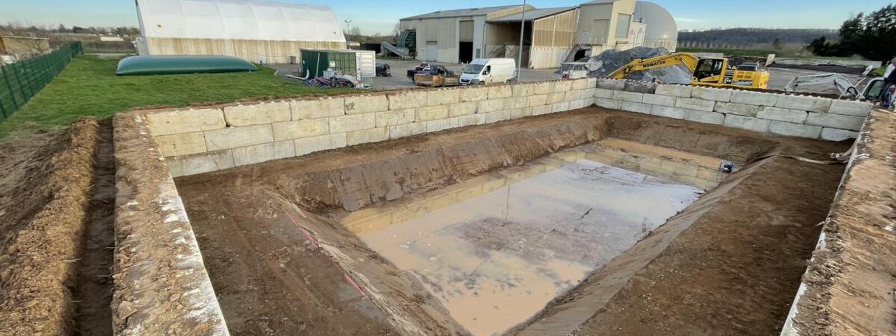

# 🌊 Site Vitrine — Spécialiste Géomembrane & Étanchéité

Site web **une page** (one-page) pour une entreprise spécialisée en géomembrane, étanchéité de bassins, citernes souples et chaudronnerie plastique.

**Aucune connaissance technique n'est requise** pour personnaliser ce site. Suivez simplement le guide ci-dessous.



---

## 📁 Contenu du dossier

```
boite-gestion-eau/
│
├── index.html              ← Le site (tout est dans ce fichier unique)
├── README.md               ← Ce fichier d'aide
│
└── images/                 ← Toutes les photos du site
    ├── hero-bg.jpg         ← Photo de fond (bandeau principal)
    ├── hero-side.jpg       ← Photo à droite du bandeau principal
    ├── equipe.jpg          ← Photo section "L'entreprise"
    ├── realisation-1.jpg   ← Galerie photo 1 (grande image)
    ├── realisation-2.jpg   ← Galerie photo 2
    ├── realisation-3.jpg   ← Galerie photo 3
    ├── realisation-4.jpg   ← Galerie photo 4
    ├── realisation-5.jpg   ← Galerie photo 5
    └── realisation-6.jpg   ← Galerie photo 6
```

---

## 🚀 Comment mettre en ligne le site

### Méthode 1 — Hébergement classique (OVH, Ionos, o2switch…)

1. Téléchargez ce dossier complet (bouton vert **Code** → **Download ZIP**)
2. Décompressez le ZIP sur votre ordinateur
3. Connectez-vous à votre hébergeur via **FileZilla** ou le **gestionnaire de fichiers** de votre hébergeur
4. Uploadez **tout le contenu** du dossier dans le répertoire `www/` (ou `public_html/`)
5. C'est en ligne ✅

### Méthode 2 — GitHub Pages (gratuit)

1. Créez un compte sur [github.com](https://github.com) si ce n'est pas déjà fait
2. Cliquez sur **Use this template** ou **Fork** ce dépôt
3. Allez dans **Settings** → **Pages** → Source : **main** / dossier **/ (root)**
4. Votre site est en ligne à `https://votre-nom.github.io/boite-gestion-eau/`

---

## ✏️ Comment personnaliser le site

Ouvrez le fichier `index.html` avec **n'importe quel éditeur de texte** (Bloc-notes, TextEdit, Notepad++, VS Code…).

Utilisez la fonction **Rechercher-Remplacer** (Ctrl+H sur PC, Cmd+H sur Mac) pour modifier les éléments suivants :

### Étape 1 — Nom de l'entreprise

| Chercher | Remplacer par | Exemple |
|---|---|---|
| `[NOM ENTREPRISE]` | Le nom de votre entreprise | `Géomembrane Sud-Ouest` |
| `[NOMENTREPRISE]` | (dans le logo) Même nom | `GéomembraneSO` |

> 💡 Le logo texte utilise `[NOM` + `ENTREPRISE]` (la 2e partie est en orange). Adaptez selon votre nom.

### Étape 2 — Coordonnées

| Chercher | Remplacer par | Exemple |
|---|---|---|
| `[VILLE]` | Votre ville | `Agen` |
| `[ADRESSE]` | Votre adresse | `Zone Artisanale du Lac` |
| `[CODE POSTAL]` | Votre code postal | `47000` |
| `05 00 00 00 00` | Votre numéro de téléphone | `05 53 12 34 56` |
| `contact@entreprise.fr` | Votre e-mail | `contact@geomembrane-so.fr` |

> ⚠️ **Important :** le numéro de téléphone apparaît aussi dans les liens `tel:+33500000000`. Remplacez `+33500000000` par votre numéro au format international (ex: `+33553123456`).

### Étape 3 — Année de création

| Chercher | Remplacer par | Exemple |
|---|---|---|
| `[ANNÉE]` | L'année de création de l'entreprise | `2005` |
| `+[XX]` | Le nombre d'années d'expérience | `+20` |

### Étape 4 — Chiffres clés (optionnel)

Dans la section du bandeau principal, vous pouvez modifier les statistiques affichées :
- `+300` → Nombre de bassins par an
- `100%` → Pourcentage de conformité
- Les textes descriptifs en dessous

---

## 🖼️ Comment changer les photos

### Méthode simple

1. Préparez vos photos en **JPG**, idéalement **1200 pixels de large minimum**
2. Renommez-les avec **exactement** les mêmes noms que les fichiers existants :

| Fichier à remplacer | Où elle apparaît | Taille recommandée |
|---|---|---|
| `images/hero-bg.jpg` | Fond du bandeau principal | 1920 × 1080 px |
| `images/hero-side.jpg` | Photo à droite du bandeau | 800 × 600 px |
| `images/equipe.jpg` | Section "L'entreprise" | 800 × 600 px |
| `images/realisation-1.jpg` | Galerie — grande image | 1200 × 900 px |
| `images/realisation-2.jpg` | Galerie — image 2 | 800 × 600 px |
| `images/realisation-3.jpg` | Galerie — image 3 | 800 × 600 px |
| `images/realisation-4.jpg` | Galerie — image 4 | 800 × 600 px |
| `images/realisation-5.jpg` | Galerie — image 5 | 800 × 600 px |
| `images/realisation-6.jpg` | Galerie — image 6 | 800 × 600 px |

3. Placez vos nouvelles photos dans le dossier `images/` (elles écraseront les anciennes)
4. C'est tout ✅

### Changer les légendes de la galerie

Dans le fichier `index.html`, cherchez `data-label=` pour trouver les légendes de chaque photo de la galerie. Modifiez le texte entre guillemets :

```html
<!-- Avant -->
<div class="gallery-item" data-label="Terrassement de bassin agricole">

<!-- Après -->
<div class="gallery-item" data-label="Votre nouvelle légende ici">
```

---

## 🎨 Couleurs du site

Le site utilise un thème **bleu marine + orange**. Si vous souhaitez changer les couleurs, modifiez les valeurs tout en haut du fichier `index.html` dans la section `:root` :

| Variable | Couleur actuelle | Utilisation |
|---|---|---|
| `--navy` | `#0B1D3A` | Bleu marine principal |
| `--blue-accent` | `#1B6EC2` | Bleu des liens et accents |
| `--orange` | `#D97706` | Boutons et éléments d'action |
| `--orange-light` | `#F59E0B` | Orange clair (survol, chiffres) |

---

## 📱 Fonctionnalités

- ✅ **Responsive** — S'adapte à tous les écrans (mobile, tablette, ordinateur)
- ✅ **Menu mobile** — Hamburger menu sur petit écran
- ✅ **Animations** — Apparition progressive des sections au défilement
- ✅ **Formulaire de contact** — Prêt à être connecté à un service d'envoi
- ✅ **SEO** — Balises meta description et titre optimisés
- ✅ **Rapide** — Un seul fichier HTML, pas de framework lourd

---

## 📬 Connecter le formulaire de contact

Par défaut, le formulaire affiche une alerte JavaScript. Pour recevoir les messages par e-mail, vous avez plusieurs options gratuites :

### Option 1 — Formspree (le plus simple)

1. Créez un compte gratuit sur [formspree.io](https://formspree.io)
2. Créez un nouveau formulaire et copiez l'URL fournie
3. Dans `index.html`, cherchez le `<button type="button"` du formulaire
4. Remplacez le `<button>` par un vrai `<form>` pointant vers Formspree

### Option 2 — Netlify Forms

Si vous hébergez sur Netlify, ajoutez simplement `netlify` dans la balise `<form>` et ça fonctionne automatiquement.

---

## ❓ Questions fréquentes

**Je ne vois pas mes images après la mise en ligne ?**
→ Vérifiez que le dossier `images/` est bien uploadé au même niveau que `index.html`, et que les noms de fichiers sont exactement les mêmes (attention aux majuscules/minuscules).

**Le formulaire ne fonctionne pas ?**
→ C'est normal : par défaut il affiche juste une alerte. Voir la section "Connecter le formulaire" ci-dessus.

**Comment ajouter une page ?**
→ Ce site est conçu comme une page unique. Pour un site multi-pages, dupliquez `index.html` et adaptez le contenu et la navigation.

**Puis-je utiliser ce template pour un autre métier ?**
→ Oui ! Il suffit de changer les textes, photos et couleurs.

---

## 📄 Licence

Ce template est libre d'utilisation pour un usage commercial ou personnel. Aucune attribution requise.
